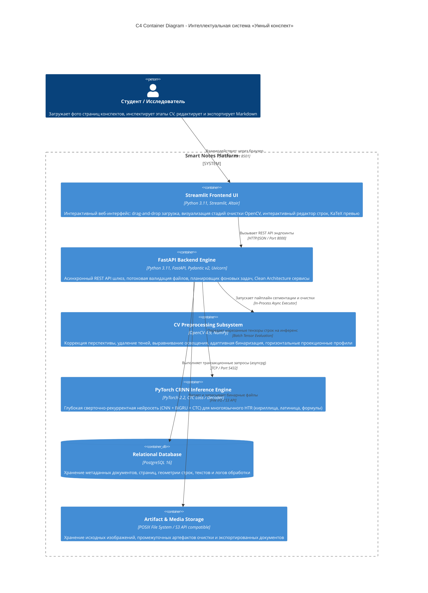
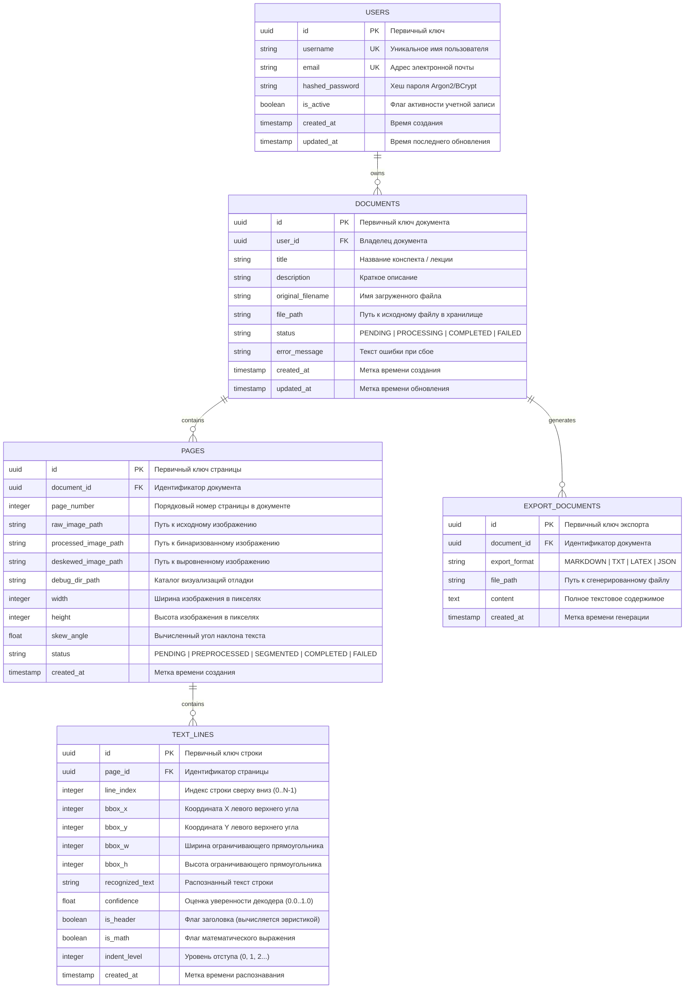

# Smart Notes (Интеллектуальная система «Умный конспект»)

[](https://www.python.org/downloads/)
[](https://fastapi.tiangolo.com)
[](https://pytorch.org/)
[](https://opencv.org/)
[](https://www.postgresql.org/)
[](https://streamlit.io/)
[](LICENSE)

«Умный конспект» — это комплексная распределенная программная система корпоративного уровня для автоматизированного распознавания, очистки от оптических искажений, сегментации рукописных строк и семантического структурирования рукописных конспектов, лекций и математических формул в формат Markdown / LaTeX / TXT.

---

## 1. Архитектурный чертеж C4 (Container Diagram)



---

## 2. Диаграмма сущностей базы данных (ERD)



---

## 3. Матрица угроз и стратегии защиты (STRIDE / OWASP)

| Угроза / Вектор атаки | Категория | Риск | Архитектурное решение / Механизм защиты |
|---|---|---|---|
| **DoS / OOM через загрузку гигантских файлов** | Denial of Service | Высокий | Потоковая буферизация `StreamingUpload` в FastAPI с ограничением максимального размера (по умолчанию 25 МБ). Принудительное ограничение разрешения (макс. 4096px по длинной стороне) с пропорциональным ресайзом в памяти. |
| **Декомпрессионная бомба (Image Decompression Bomb)** | Denial of Service | Высокий | Защита на уровне PIL / OpenCV: проверка заголовков файла, лимит пикселей `Image.MAX_IMAGE_PIXELS = 64_000_000` и перехват исключений поврежденных буферов. |
| **Инъекции в SQL-запросы** | Tampering / Information Disclosure | Критический | Применение SQLAlchemy 2.0 ORM и параметризованных запросов с типизированными моделями. Отсутствие динамической интерполяции сырых строк в SQL. |
| **Path Traversal / Local File Inclusion** | Elevation of Privilege | Критический | Генерация случайных UUIDv4 имен файлов при сохранении на диск. Изоляция хранилища в каталоге `STORAGE_DIR`, строгая санитизация путей через `pathlib.Path.resolve()` и проверка выхода за пределы корня хранилища. |
| **Переполнение памяти видеокарты / RAM при инференсе** | Denial of Service | Высокий | Батчирование нарезанных строк с фиксированным `batch_size`, автоматическое переключение `torch.no_grad()`, очистка кеша PyTorch `torch.cuda.empty_cache()` в блоках `finally`. |
| **Некорректная бинаризация при неравномерном освещении** | Fault Tolerance | Средний | Двухэтапная нормализация: вычисление фона морфологическим закрытием/открытием, деление яркостного канала на оценку фона, адаптивный порог Гаусса с локальным окном. |

---

## 4. Быстрый запуск системы

### Вариант 1: Развертывание в Docker (Рекомендуемый)

```bash
# Клонирование и переход в каталог проекта
cd /home/dima/Ai\ detector

# Запуск всего стека одной командой
docker compose up --build -d

# Проверка логов бэкенда и базы данных
docker compose logs -f backend
```

- **Веб-интерфейс Streamlit**: http://localhost:8501
- **REST API документация Swagger**: http://localhost:8000/docs
- **ReDoc API спецификация**: http://localhost:8000/redoc

### Вариант 2: Локальный запуск для разработки

```bash
# 1. Создание виртуального окружения
python3 -m venv venv
source venv/bin/activate

# 2. Установка зависимостей
pip install -r requirements.txt

# 3. Инициализация весов и базы данных
python3 scripts/generate_synthetic_weights.py

# 4. Запуск FastAPI бэкенда
uvicorn app.api.main:app --host 0.0.0.0 --port 8000 --reload

# 5. Запуск Streamlit фронтенда (в отдельном терминале)
streamlit run frontend/app.py --server.port 8501
```

---

## 5. Тестирование

```bash
# Запуск полного набора модульных и интеграционных тестов
pytest tests/ -v
```
